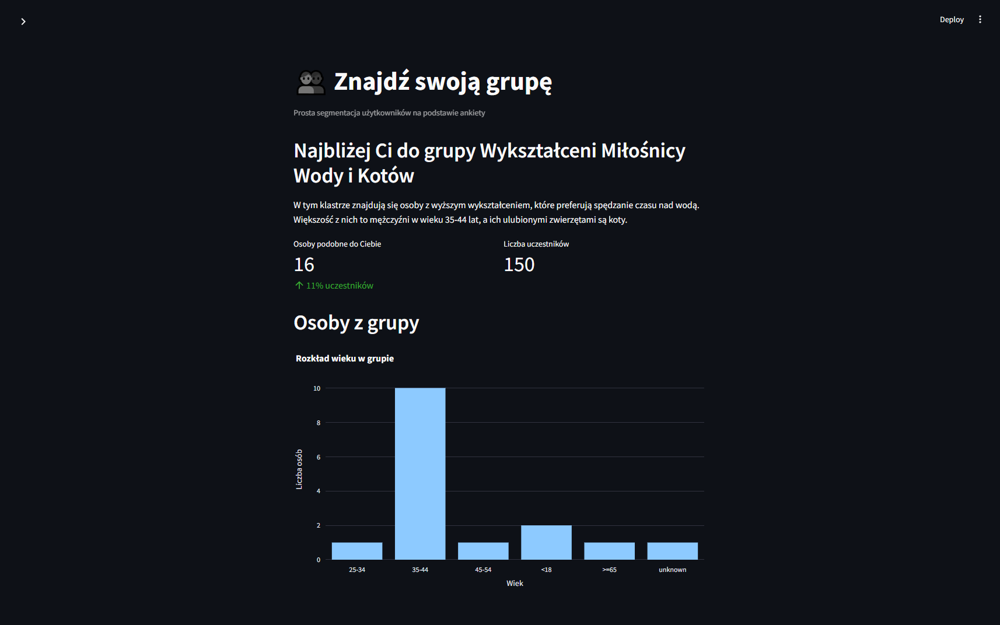
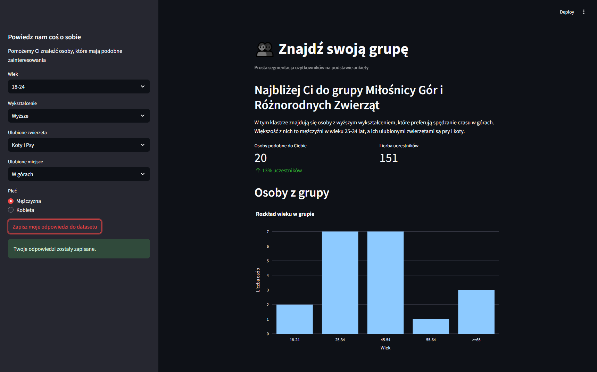
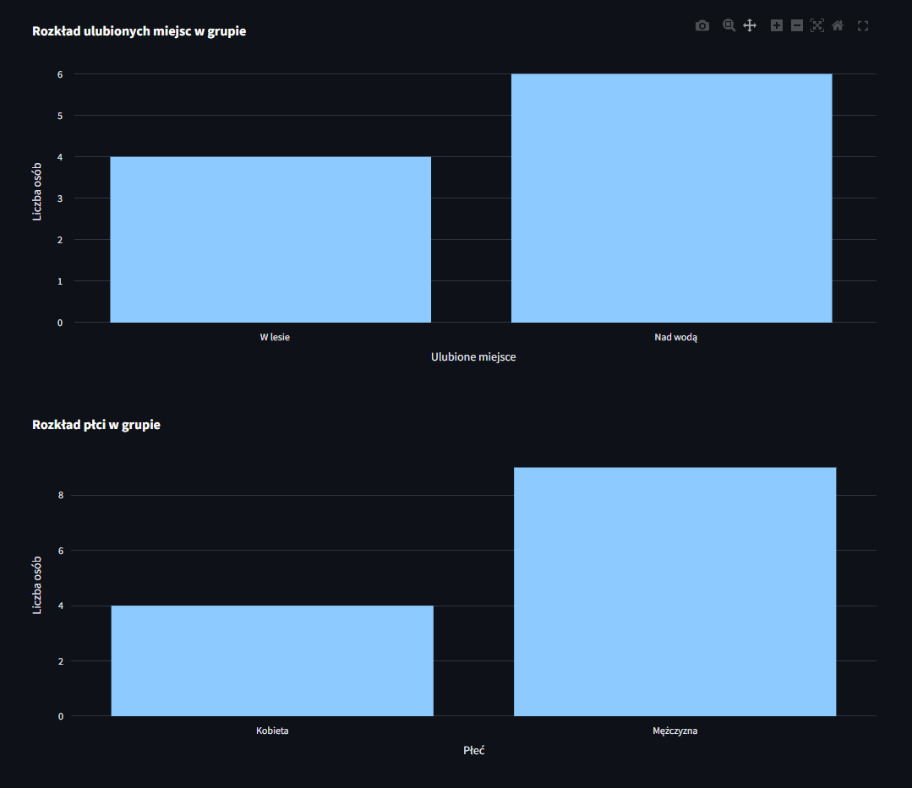

# 👥 Find Friends App

Machine Learning application that groups users with similar profiles using clustering and presents statistics for the resulting group.

## 🚀 Live Demo

[https://find-friends-app-goldmanski.streamlit.app](https://find-friends-app-goldmanski.streamlit.app)

The application allows users to complete a short survey and find the user group that is most similar to their profile.

---

## 📸 Screenshots

### Main Application

The main screen allows users to provide information about themselves and receive a cluster assignment together with information describing the group.

### Group Statistics

The application presents interactive visualizations showing the age and education distribution of users belonging to the assigned cluster.

### Additional Group Statistics

Additional visualizations show the distribution of favorite animals, favorite places, and gender within the assigned cluster.

## 📌 Project Overview

Find Friends App is an interactive Streamlit application that uses an unsupervised Machine Learning model to group users based on their survey responses.

The user provides information about:

- age
- education level
- favorite animals
- favorite place
- gender

The application converts the responses into a Pandas DataFrame and passes them to a trained clustering pipeline.

The model assigns the user to one of the predefined clusters. The application then displays:

- the name and description of the assigned cluster
- the number of users in the same cluster
- the percentage of participants belonging to the same cluster
- the total number of participants
- visual statistics describing the group

Users can also save their survey responses to the dataset directly from the application.

The clustering workflow was developed using PyCaret.

## ✨ Features

- Interactive survey form
- User cluster prediction
- Cluster names and descriptions
- Number of users in the assigned cluster
- Percentage of users similar to the current user
- Total number of participants
- Saving new survey responses to the dataset
- Confirmation message after saving responses
- Age distribution visualization
- Education level distribution
- Favorite animals distribution
- Favorite place distribution
- Gender distribution
- Cached Machine Learning model
- Cached dataset processing
- Interactive visualizations with Plotly
- Deployment using Streamlit Community Cloud

## 🛠️ Tech Stack

- Python
- Streamlit
- PyCaret
- Pandas
- Plotly
- Scikit-learn

## 🏛️ Architecture

The application combines a Streamlit user interface with a trained clustering pipeline.

    User
      │
      ▼
    Streamlit Application
      │
      ▼
    Survey Responses
      │
      ▼
    Pandas DataFrame
      │
      ├──► Cluster Prediction
      │
      └──► Optional Dataset Update
                    │
                    ▼
              CSV Dataset
                    │
                    ▼
          PyCaret Clustering Pipeline
                    │
                    ▼
              Predicted Cluster
                    │
                    ├──► Cluster Name & Description
                    │
                    └──► Users from the Same Cluster
                            │
                            ▼
                        Plotly Visualizations

## 🤖 Machine Learning Layer

The model processes the following user attributes:

- Age
- Education level
- Favorite animals
- Favorite place
- Gender

The trained model is stored locally in the repository:

    welcome_survey_clustering_pipeline_v1.pkl

The model is loaded with PyCaret and cached using Streamlit's `st.cache_data`.

## 📊 Cluster Information

Each cluster has a human-readable name and description stored in:

    welcome_survey_cluster_names_and_descriptions_v1.json

The cluster names and descriptions were generated using an LLM based on the characteristics of the clusters identified by the Machine Learning model.

The JSON file is used by the application to present a human-readable interpretation of the predicted cluster.

## 📁 Project Structure

    find_friends_app/
    │
    ├── screenshots/
    │   ├── screenshot_main.png
    │   ├── screenshot_statistics.png
    │   └── screenshot_statistics_2.png
    ├── app.py
    ├── find_friends_clustering.ipynb
    ├── welcome_survey_simple_v1.csv
    ├── welcome_survey_clustering_pipeline_v1.pkl
    ├── welcome_survey_cluster_names_and_descriptions_v1.json
    ├── requirements.txt
    ├── README.md
    └── .gitignore

### Main Components

- `app.py` — Streamlit application and user interface
- `find_friends_clustering.ipynb` — clustering workflow and model development
- `welcome_survey_simple_v1.csv` — source user survey dataset
- `welcome_survey_clustering_pipeline_v1.pkl` — trained clustering pipeline
- `welcome_survey_cluster_names_and_descriptions_v1.json` — cluster names and descriptions
- `requirements.txt` — Python dependencies
- `screenshots/` — application screenshots
- `.gitignore` — files excluded from version control

## ⚙️ How It Works

1. The user completes the survey in the Streamlit sidebar.
2. The responses are converted into a Pandas DataFrame.
3. The trained clustering pipeline predicts the user's cluster.
4. The application loads the corresponding cluster name and description.
5. The dataset is processed with the same clustering model.
6. Users belonging to the predicted cluster are selected.
7. The application calculates the number and percentage of users in the same cluster.
8. The application displays the total number of participants.
9. The user can optionally save their responses to the dataset.
10. The dataset processing cache is cleared after a new response is saved.
11. Plotly visualizations present the characteristics of the group.

## 🔍 Example Workflow

### User Input

    Age: 45-54
    Education: Wyższe
    Favorite animals: Psy
    Favorite place: W górach
    Gender: Mężczyzna

### Result

The application assigns the user to the cluster that best matches the provided profile.

The result includes:

- cluster name
- cluster description
- number of users in the cluster
- percentage of participants belonging to the cluster
- total number of participants
- age distribution
- education distribution
- favorite animals distribution
- favorite place distribution
- gender distribution

The user can also save their responses to the dataset using the button in the sidebar.

## 🚀 Installation

Clone the repository:

    git clone https://github.com/Goldmanski/find_friends_app.git
    cd find_friends_app

Create a virtual environment:

    python -m venv .venv

### Windows

    .venv\Scripts\activate

### Linux / macOS

    source .venv/bin/activate

Install dependencies:

    pip install -r requirements.txt

## ▶️ Run

Start the application with:

    streamlit run app.py

The application will be available locally through the Streamlit interface.

## ☁️ Deployment

The application is deployed using Streamlit Community Cloud.

The trained clustering model and supporting project files are included directly in the GitHub repository and loaded by the application at runtime.

## 🎯 Design Goals

The project focuses on combining several Machine Learning concepts into a simple interactive application:

- Unsupervised Machine Learning
- Clustering
- Data preprocessing
- Model inference
- Interactive web applications
- Data visualization
- Model integration with Streamlit

The goal is to demonstrate how a trained clustering model can be integrated into a user-facing application and used to provide meaningful group-level insights.

## 🔮 Possible Future Improvements

- Similarity search between individual users
- Recommendation system
- Database integration
- Model retraining pipeline
- Dataset management
- Additional user attributes
- More advanced cluster analysis
- Improved cluster descriptions
- User authentication
- REST API

## 👤 Author

Created by Eliasz Nowicki as a Machine Learning and Streamlit portfolio project.